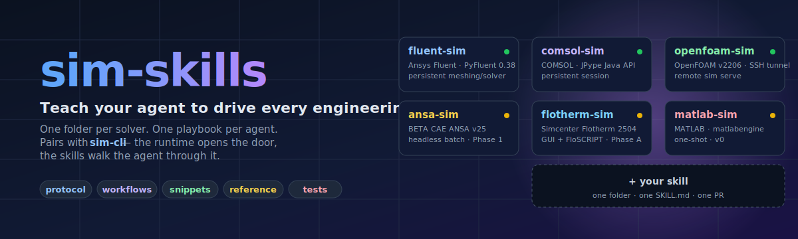

<div align="center">



<br>

**Teach your agent to drive every engineering tool.**

*[`sim-cli`](https://github.com/svd-ai-lab/sim-cli) opens the door.*
*`sim-skills` walks the agent through it.*

<p align="center">
  <a href="#-the-skill-grid"></a>
  <a href="https://github.com/svd-ai-lab/sim-cli"></a>
  <a href="#-how-an-agent-uses-a-skill"></a>
  <a href="LICENSE"></a>
</p>

<p align="center">
  
  
  
  
</p>

[The Skill Grid](#-the-skill-grid) · [Why](#-why-sim-skills) · [How to use](#-how-an-agent-uses-a-skill) · [Conventions](#-cross-skill-conventions) · [Runtime](#-runtime-dependency) · [sim-cli →](https://github.com/svd-ai-lab/sim-cli)

</div>

---

## 🤔 Why sim-skills?

LLM agents already know how to write PyFluent, MATLAB, COMSOL, and OpenFOAM scripts — training data is full of them. What they *don't* have is **operational discipline** for each tool: which inputs are physical decisions vs. operational defaults, what the acceptance criterion actually is, when to stop and ask, which API version's quirks bite where.

Writing the same discipline into every agent prompt from scratch is how teams burn weeks and waste compute. `sim-skills` is the missing library:

- **One folder per solver.** Each folder is a self-contained Anthropic-format skill — `SKILL.md` with YAML frontmatter, plus `reference/`, `workflows/`, `snippets/`, `tests/` as the SKILL.md points to them.
- **Runtime control, not API tutoring.** The skills tell the agent how to drive `sim connect / exec / inspect / disconnect` safely — they assume the agent already knows the solver's own API, and teach it the *operational* layer around that.
- **Cross-skill conventions baked in.** Input classification (Category A/B/C), acceptance-criterion rules, and escalation triggers live in [`CLAUDE.md`](CLAUDE.md) so every skill obeys the same protocol.
- **Paired with [`sim-cli`](https://github.com/svd-ai-lab/sim-cli).** The runtime provides the transport; the skills provide the playbook. Neither works well alone.

> Think of it this way: `sim-cli` is the ignition and the steering wheel. `sim-skills` is the driving school.

---

## 🧭 The Skill Grid

Every skill lives in its own top-level folder. The grid is **open and growing** — add a new skill by dropping a `<solver>/SKILL.md` in and registering it in [`CLAUDE.md`](CLAUDE.md). Current contents of `main`:

| Skill | Domain | Execution model | Phase | What it's for |
|---|---|---|---|---|
| [**sim-cli**](sim-cli/SKILL.md) | *Shared contract* | Both (persistent + one-shot) | Working ✅ | The runtime contract every driver skill depends on — session lifecycle, command surface, input classification, Step-0 version probe, acceptance, escalation. **Load alongside any driver skill below.** |
| [**fluent-sim**](fluent/SKILL.md) | CFD | Persistent meshing / solver session (PyFluent 0.38) | v0 ✅ | Incremental `sim exec` snippets or single-file workflows against a live Fluent session |
| [**comsol-sim**](comsol/SKILL.md) | Multiphysics | Persistent JPype Java API session | Working ✅ | Long multiphysics runs with optional human GUI oversight |
| [**openfoam-sim**](openfoam/SKILL.md) | CFD (OSS) | Remote `sim serve` on Linux via SSH tunnel | Working ✅ | Meshing, MPI parallel, classifier-based pass/fail on OpenFOAM v2206 |
| [**ansa-sim**](ansa/SKILL.md) | Structural pre-processing | Headless batch (`ansa_win64 -execscript -nogui`) | Phase 1 🟡 | BETA CAE ANSA v25 scripts; no persistent session yet |
| [**flotherm-sim**](flotherm/SKILL.md) | Electronics thermal | GUI + Win32 FloSCRIPT playback | Working ✅ | Simcenter Flotherm 2504 natural-language model generation, XSD-validated FloSCRIPT, checkpoint-based step-by-step build |
| [**matlab-sim**](matlab/SKILL.md) | Numerical / scripting | One-shot `sim run --solver matlab` | v0 🟡 | `.m` scripts one-shot; persistent session planned for v1 |
| [**workbench-sim**](workbench/SKILL.md) | CAE orchestration | Persistent PyWorkbench SDK + RunWB2 fallback | Working ✅ | Ansys Workbench project/system/journal orchestration; cells 1-3 of Static Structural |
| [**mechanical-sim**](mechanical/SKILL.md) | Structural physics | Persistent PyMechanical gRPC session (GUI) | Working ✅ | Ansys Mechanical BCs/solve/results; cells 4-6 of Static Structural. E2E tested with official example. |
| [**starccm-sim**](starccm/SKILL.md) | CFD / Multiphysics | One-shot batch Java macros (`starccm+ -batch`) | Working ✅ | Simcenter STAR-CCM+ 2602 geometry, meshing, solver execution via Java macros. E2E tested. |
| [**abaqus-sim**](abaqus/SKILL.md) | Structural FEA | One-shot `.inp` decks or Abaqus/CAE Python scripts | Working ✅ | Dassault Systemes SIMULIA Abaqus static/dynamic/thermal FEA; cantilever beam E2E with deformation contour evidence. |
| [**pybamm-sim**](pybamm/SKILL.md) | Battery modeling | One-shot `sim run --solver pybamm` | Working ✅ | PyBaMM DFN / SPM / SPMe battery models; no separate solver binary — the pybamm package version *is* the solver version. |
| [**cfx-sim**](cfx/SKILL.md) | CFD (turbomachinery) | Persistent hybrid (`cfx5post -line` + batch render) | Working ✅ | Ansys CFX via CCL definition files, interactive post-processing, hybrid contour rendering. E2E verified with VMFL015. |
| [**lsdyna-sim**](lsdyna/SKILL.md) | Explicit FEA | One-shot `lsdyna i=<file.k>` | Working ✅ | Ansys LS-DYNA explicit/implicit nonlinear FEA; keyword file validation, auto DLL discovery. Single hex tension E2E. |
| [**mapdl-sim**](mapdl/SKILL.md) | Implicit FEA | Both: one-shot `sim run` + persistent PyMAPDL gRPC session (`sim connect/exec/inspect`) | Working ✅ | Ansys MAPDL static / modal / thermal / harmonic. 2D I-beam + 3D notched-plate Phase 1 E2E; same 2D beam re-driven through 10-step session (Phase 2). Headless PyVista contour PNGs. |
| [**icem-sim**](icem/SKILL.md) | Meshing preprocessor | One-shot `icemcfd.bat -batch -script <file.tcl>` | Working ✅ | Ansys ICEM CFD Tcl batch meshing. Box.tin → 26752 tetra E2E (3.9s). 143 solver export interfaces. |
| [**calculix-sim**](calculix/SKILL.md) | Static / frequency / thermal FEA | One-shot `ccx -i <file>` | Working ✅ | Open-source Abaqus-dialect `.inp` on Linux. Cantilever tip U2 = −2002 (0.1 % err). |
| [**gmsh-sim**](gmsh/SKILL.md) | Mesh generation | One-shot `gmsh -3 <file.geo>` / Python API | Working ✅ | 2D/3D meshing with CAD import; exports for CalculiX/OpenFOAM/FEniCS/SU2. |
| [**su2-sim**](su2/SKILL.md) | Open-source CFD | One-shot `SU2_CFD <file.cfg>` | Working ✅ | NACA0012 inviscid, RMS[Rho] dropped 3.5 orders. |
| [**lammps-sim**](lammps/SKILL.md) | Molecular dynamics | One-shot `lmp -in <file.in>` | Working ✅ | LJ NVT Nose-Hoover, final T = 1.07 (target 1.5). |
| [**scikit-fem-sim**](scikit_fem/SKILL.md) | Pure-Python FEM | One-shot Python script | Working ✅ | Poisson on unit square, u_max = 0.07345 (0.3 % err). |
| [**elmer-sim**](elmer/SKILL.md) | Multi-physics FEM | One-shot `ElmerSolver <file.sif>` | Working ✅ | CSC-IT `.sif` heat/elasticity/EM/fluid. Steady heat max = 0.07426 (0.8 % err). |
| [**meshio-sim**](meshio/SKILL.md) | Mesh format conversion | One-shot Python script | Working ✅ | 20+ mesh formats, the glue between sim's pre-processors and solvers. |
| [**pyvista-sim**](pyvista/SKILL.md) | Post-processing | One-shot Python script | Working ✅ | Scalar stats, iso-surfaces, area/volume integration, headless PNG. |
| [**pymfem-sim**](pymfem/SKILL.md) | High-order FEM | One-shot Python script | Working ✅ | LLNL MFEM bindings. Poisson u_max = 0.07353 (0.2 % err via UMFPackSolver). |
| [**openseespy-sim**](openseespy/SKILL.md) | Structural / earthquake FEM | One-shot Python script | Working ✅ | PEER's OpenSees. Cantilever tip err 1.3e-12. |
| [**sfepy-sim**](sfepy/SKILL.md) | Pure-Python FEM (weak forms) | One-shot Python script | Working ✅ | Term / Problem API. Poisson 1.3 % err on 8×8 mesh. |
| [**cantera-sim**](cantera/SKILL.md) | Combustion / kinetics | One-shot Python script | Working ✅ | LBNL / Caltech. CH4/air adiabatic flame T = 2225.5 K. |
| [**openmdao-sim**](openmdao/SKILL.md) | Multi-disciplinary optimization | One-shot Python script | Working ✅ | NASA MDAO. Sellar coupled MDA y1 = 25.59, y2 = 12.06. |
| [**fipy-sim**](fipy/SKILL.md) | Finite-volume PDE | One-shot Python script | Working ✅ | NIST FVM. 1D steady Poisson err 1.6e-15. |
| [**pymoo-sim**](pymoo/SKILL.md) | Multi-objective optimization | One-shot Python script | Working ✅ | NSGA-II/III, MOEA/D, CMAES. ZDT1 36 Pareto solutions. |
| [**pyomo-sim**](pyomo/SKILL.md) | Optimization modeling | One-shot Python script | Working ✅ | Sandia LP/MIP/NLP. Classic LP obj = 36 via HiGHS. |
| [**simpy-sim**](simpy/SKILL.md) | Discrete-event simulation | One-shot Python script | Working ✅ | Queueing, manufacturing. M/M/1 L err 1.9 %. |
| [**trimesh-sim**](trimesh/SKILL.md) | Triangular-mesh processing | One-shot Python script | Working ✅ | STL/OBJ/PLY, volume/area/inertia. Box V = 24 exact. |
| [**devito-sim**](devito/SKILL.md) | Symbolic FD + JIT C codegen | One-shot Python script | Working ✅ | Imperial College. 2D heat mass conservation 4e-7. |
| [**coolprop-sim**](coolprop/SKILL.md) | Thermo-properties | One-shot Python script | Working ✅ | REFPROP-equivalent. Water @ 1 atm T_sat = 373.124 K. |
| [**scikit-rf-sim**](scikit_rf/SKILL.md) | RF / microwave analysis | One-shot Python script | Working ✅ | Touchstone I/O, S-parameters. Short/open/match S11 = −1/+1/0 exact. |
| [**pandapower-sim**](pandapower/SKILL.md) | Power-system analysis | One-shot Python script | Working ✅ | Fraunhofer IEE. 2-bus PF vm_pu = 0.998, losses 1.4 kW. |
| [**paraview-sim**](paraview/SKILL.md) | Post-processing / visualization | One-shot `pvpython` / `pvbatch` | Working ✅ | Kitware ParaView. 30+ file formats, Clip/Slice/Contour/StreamTracer, headless PNG rendering. |
| [**hypermesh-sim**](hypermesh/SKILL.md) | FE pre-processing | One-shot `hw -b -script` | Working ✅ | Altair HyperMesh. 225 entity classes, 1946 methods. CAD import, automesh/tetmesh, quality checks, solver deck export. |
| [**isaac-sim**](isaac/SKILL.md) | Embodied-AI simulation | One-shot `sim run <script.py> --solver isaac` | Working ✅ | NVIDIA Isaac Sim 4.5 (Omniverse Kit). SimulationApp bootstrap contract, AST lint for import-order, `official_hello_world` + Franka + Replicator + warehouse_sdg snippets. |
| [**newton-sim**](newton/SKILL.md) | GPU physics / embodied AI | Two routes: Route A (recipe JSON) or Route B (`.py` run-script) | Working ✅ | NVIDIA Newton 1.x on Warp. Declarative recipe schema, 6 solver backends (XPBD/VBD/MuJoCo/MPM/Style3D/SemiImplicit), basic_pendulum + robot_g1 + cable_twist E2E workflows. |
| **+ your skill** | — | — | 🛠 | Drop a `<solver>/SKILL.md`, register in `CLAUDE.md`, open a PR |

**Legend** · ✅ Working · 🟡 In progress (phased rollout) · 🛠 Open for contribution

---

## 🎯 How an agent uses a skill

When a task involves a supported solver, the agent follows the same five steps for every skill:

1. **Identify the solver** from the user's request
2. **Read** `<solver>/SKILL.md` — its YAML `description` says exactly when the skill applies, and the body has the required protocol
3. **Follow the protocol**: input validation → connect → execute → verify → report
4. **Reach for supporting files** when SKILL.md tells it to:
   - `reference/` — patterns, templates, API docs
   - `workflows/` — end-to-end example cases
   - `snippets/` — ready-made `sim exec` payloads
   - `skill_tests/` — manual acceptance test cases
5. **Never invent solver-specific defaults** for Category A inputs (physical decisions) — ask the user

The human workflow is even simpler: an engineer points the LLM at `sim-skills`, names the solver, and the agent knows what to do next.

---

## 📏 Cross-skill conventions

These apply to every driver skill in the grid. They live canonically in
the **[`sim-cli/`](sim-cli/SKILL.md)** shared skill — summary here:

| Convention | One-line rule | Full |
|---|---|---|
| **Category A inputs** | Physical decisions (geometry, materials, BCs, acceptance criteria). **Ask the user** if absent. | [input_classification.md](sim-cli/reference/input_classification.md) |
| **Category B inputs** | Operational defaults (processors, ui_mode, smoke-test iterations). May default; must disclose. | [input_classification.md](sim-cli/reference/input_classification.md) |
| **Category C inputs** | File-derivable (cell zones, surface names). Infer via a diagnostic snippet, not from reference examples. | [input_classification.md](sim-cli/reference/input_classification.md) |
| **Acceptance criteria** | `exit_code == 0` is **not** sufficient. Every task needs an outcome-based criterion. | [acceptance.md](sim-cli/reference/acceptance.md) |
| **Step-0 version probe** | Mandatory. `sim inspect session.versions` after connect; pick layered-folder content from the returned profile. | [version_awareness.md](sim-cli/reference/version_awareness.md) |
| **Reference examples ≠ defaults** | Values in `<skill>/reference/examples/` describe a specific published test case. Offer them, never silently adopt them. | [input_classification.md](sim-cli/reference/input_classification.md) |
| **When to stop** | Solver fails to launch, snippet raises or returns `ok=false`, session drifts, acceptance fails → report, don't silently retry. | [escalation.md](sim-cli/reference/escalation.md) |

---

## 🔌 Runtime dependency

These skills are useless without the [`sim-cli`](https://github.com/svd-ai-lab/sim-cli) runtime. The runtime provides:

- `sim connect / exec / inspect / disconnect` for persistent solver sessions
- `sim run` for one-shot scripts
- `sim lint`, `sim logs`, `sim ps` for the operational layer around both

For each solver there is a matching driver at `sim-cli/src/sim/drivers/<solver>/`. The skill in this repo is the agent-facing protocol; the driver is the Python-facing implementation. Neither works well alone.

```bash
# Install the runtime (has all seven drivers available today):
uv pip install "git+https://github.com/svd-ai-lab/sim-cli.git"

# Then point your LLM agent at this repo and let it read the SKILL.md files.
```

---

## 📂 Repo layout

```
sim-skills/
├── README.md          this file (human-facing)
├── CLAUDE.md          AI-facing index, protocol, cross-skill conventions
├── LICENSE            Apache-2.0
│
├── fluent/            Ansys Fluent via PyFluent (persistent sessions)
├── comsol/            COMSOL Multiphysics via JPype Java API
├── openfoam/          OpenFOAM v2206 via SSH-tunneled sim serve
├── ansa/              BETA CAE ANSA v25 pre-processor (batch, Phase 1)
├── flotherm/          Simcenter Flotherm 2504 (GUI + Win32, Phase A)
├── matlab/            MATLAB via sim run (v0 one-shot)
├── workbench/         Ansys Workbench orchestration via PyWorkbench (cells 1-3)
├── mechanical/        Ansys Mechanical BCs/solve/results via PyMechanical (cells 4-6)
├── starccm/           Simcenter STAR-CCM+ 2602 via Java macros (batch)
├── abaqus/            Dassault Systemes SIMULIA Abaqus via .inp decks / Abaqus/CAE Python
├── pybamm/            PyBaMM battery models (pure Python, one-shot)
├── cfx/               Ansys CFX turbomachinery/general-purpose CFD via CCL + cfx5solve
├── lsdyna/            Ansys LS-DYNA explicit/implicit nonlinear FEA via .k keyword files
│
└── assets/            banner and related graphics
```

Each `<solver>/` directory is self-contained: `SKILL.md` at the top is the agent entry point; the rest (`reference/`, `workflows/`, `snippets/`, `tests/`, `skill_tests/`, `docs/`) is supporting material the SKILL.md links to as needed. Folder shapes vary by skill and by phase — Fluent and Flotherm are the most built-out today.

---

## 🔗 Related projects

- **[`sim-cli`](https://github.com/svd-ai-lab/sim-cli)** — the paired runtime. One CLI, one HTTP protocol, an open driver registry. This repo is its agent-facing twin.

---

## 📰 News

- **2026-04-19** 🤖 **Isaac Sim + Newton skills — embodied-AI category** — two new skill bundles paired with the matching sim-cli drivers. [`isaac-sim`](isaac/SKILL.md): SKILL.md + 4 reference docs (`simulation_app.md` bootstrap contract, `robots.md`, `replicator.md`, `usd_basics.md`) + 5 TDD-validated snippets (official 4.5 hello-world, custom hello-world, Franka, Replicator cubes, warehouse SDG) + `sdk/4_5/notes.md` + `solver/4_5/notes.md` + `known_issues.md`. [`newton-sim`](newton/SKILL.md): SKILL.md + 4 reference docs (recipe schema catalog, solver list, Route A vs B decision tree, newton-cli→sim CLI mapping) + 3 canonical workflows (basic_pendulum / robot_g1 / cable_twist — mirroring the driver's E2E fixtures) + `solver/1_x/notes.md` + structural tests. Each demo is validated against the solver via the companion driver E2E.
- **2026-04-16** 🔧 **HyperMesh skill (`hypermesh-sim`)** — new Altair HyperMesh FE pre-processor skill. `hm` Python API with 1946 model methods + 225 entity classes. 4 reference docs (API overview, meshing operations, entity/collection patterns, import/export), 4 snippets, 8 known issues, SDK 2025 version layer. Batch execution via `hw -b -script script.py`.
- **2026-04-16** 🔬 **ParaView skill (`paraview-sim`)** — new Kitware ParaView post-processing skill. `paraview.simple` API reference (readers, sources, filters, rendering, writers), 30+ file format guide, headless rendering setup (OSMesa/EGL/xvfb), MCP operation patterns from LLNL's `paraview_mcp`. 5 snippets (smoke test, load+stats, contour render, slice export, IntegrateVariables). 8 known issues. SDK/solver 5.13 version layers.
- **2026-04-16** 🔧 **ICEM CFD skill (`icem-sim`)** — new Ansys ICEM CFD meshing preprocessor skill. Tcl batch scripting via `icemcfd.bat -batch -script`, batch meshing API from Programmer's Guide (`ic_run_tetra` p143, `ic_run_hexa` p145, `ic_create_output` p197). 3 reference docs, 8 known issues, 4-version solver layers (24.1–25.2). Box.tin → 26752 tetra E2E verified (3.9s). No session mode — ICEM is a preprocessor, one-shot is the correct model.
- **2026-04-15** 🐍 **Pure-Python simulation ecosystem — 13 new skills** paired with their sim-cli drivers. Each skill ships `SKILL.md` + 3-4 reference docs + verified snippets + known-issues + SDK notes, and each driver E2E is physics-validated:
  - [`openseespy-sim`](openseespy/SKILL.md) — structural/earthquake FEM (cantilever tip err 1.3e-12)
  - [`sfepy-sim`](sfepy/SKILL.md) — pure-Python FEM (Poisson 1.3% err)
  - [`cantera-sim`](cantera/SKILL.md) — combustion / chemical kinetics (CH4/air T_ad = 2225 K)
  - [`openmdao-sim`](openmdao/SKILL.md) — NASA MDAO framework (Sellar MDA)
  - [`fipy-sim`](fipy/SKILL.md) — NIST finite-volume PDE (Poisson err 1.6e-15)
  - [`pymoo-sim`](pymoo/SKILL.md) — NSGA-II/III multi-objective (ZDT1 36 Pareto)
  - [`pyomo-sim`](pyomo/SKILL.md) — LP/MIP/NLP modeling (classic LP obj=36)
  - [`simpy-sim`](simpy/SKILL.md) — discrete-event simulation (M/M/1 L err 1.9%)
  - [`trimesh-sim`](trimesh/SKILL.md) — triangular mesh processing
  - [`devito-sim`](devito/SKILL.md) — symbolic FD + JIT C codegen
  - [`coolprop-sim`](coolprop/SKILL.md) — REFPROP-equivalent thermo-properties
  - [`scikit-rf-sim`](scikit_rf/SKILL.md) — RF/microwave network analysis
  - [`pandapower-sim`](pandapower/SKILL.md) — Fraunhofer IEE power-system analysis
- **2026-04-15** 🐧 **Open-source Linux CAE — 9 new skills** paired with Linux-native drivers. CFD/FEM/mesh/post-processing stack now covered end-to-end with OSS tools: [`calculix-sim`](calculix/SKILL.md), [`gmsh-sim`](gmsh/SKILL.md), [`su2-sim`](su2/SKILL.md), [`lammps-sim`](lammps/SKILL.md), [`scikit-fem-sim`](scikit_fem/SKILL.md), [`elmer-sim`](elmer/SKILL.md), [`meshio-sim`](meshio/SKILL.md), [`pyvista-sim`](pyvista/SKILL.md), [`pymfem-sim`](pymfem/SKILL.md). Each with verified physics benchmark (cantilever, Poisson, NACA0012, LJ NVT, etc.) and headless PNG evidence where relevant.
- **2026-04-14** 🔩 **MAPDL skill (`mapdl-sim`)** — new Ansys MAPDL skill covering both one-shot and session-mode driving. 4 reference docs (PyMAPDL API, command conventions, postprocessing, analysis-workflow skeletons for static/modal/thermal/harmonic), 7 hard constraints, 4-version solver layers (24.1–25.2), 1 SDK layer (0.72), 8 known issues. 3 vendor verification workflows: `mapdl_beam` (2D BEAM188 simply-supported, max UZ −0.0265 cm via `sim run`), `notch_3d` (3D SOLID186 stress concentration K_t=1.98 vs Roark 1.60), and `mapdl_beam_session` (same beam re-driven through 10-step `sim connect/exec/inspect/disconnect` lifecycle, identical physics). All workflows ship `physics_summary.json` + headless PyVista contour PNGs as evidence — no GUI scripting.
- **2026-04-14** 🌡 **Flotherm 2410 (2024.3) version layer** — added `flotherm/solver/2410/` with version notes mirroring 2504. XSD schema for FloSCRIPT validated; the headless solve crash documented in known issues (same 0xC0000005 as 2504).
- **2026-04-14** 🔬 **LS-DYNA skill — 5 official PyDyna examples driven end-to-end via real `sim` CLI**. Each workflow ships a PowerShell driver (`run_*.ps1`), a DPF rendering script, a JSON transcript of every `sim connect/exec/inspect` call, and PNG visual evidence: **Taylor Bar** (impact mushroom-head, 25 steps), **Pendulum** (Newton's cradle, 22 steps), **Pipe** (rigid-body rotation, 21 steps), **Beer Can** (Yoshimura buckling diamond pattern, 17 steps, snap-down at t=0.33), **Optimization** (4-iteration thickness sweep with monotonic stiffness trend). Plus dual-path SKILL.md (handwritten `.k` vs PyDyna `keywords` API), `session_workflow.md`, 4 PyDyna API references, and 6 example READMEs.
- **2026-04-14** 💥 **LS-DYNA skill** — new Ansys LS-DYNA solver skill for explicit/implicit nonlinear FEA. 4 reference docs (keyword format, material models, control cards, output files), single hex tension E2E with 7129-cycle normal termination evidence. 7 known issues documented including exit-code-0-on-error trap and DLL dependency auto-discovery.
- **2026-04-14** 🌀 **CFX skill** — new Ansys CFX solver skill with persistent session support. Hybrid architecture: `cfx5post -line` for instant numerical queries (Perl `evaluate()`), auto-delegated `cfx5post -batch` for contour rendering. 6 reference docs (CCL language, CLI tools, BCs, solver control, post-processing, session workflow), 4 snippets, VMFL015 E2E with 17-step session transcript + pressure/velocity contour evidence. 11 known issues documented.
- **2026-04-13** 🏭 **Abaqus + Star-CCM+ skills** — two new solver skills with E2E evidence. Abaqus: cantilever beam FEA with Abaqus/CAE deformation contour export. Star-CCM+: Java macro API reference, pipe flow mesh generation with Trimmer scene render. Both include known issues, version notes, and physics-based acceptance criteria.
- **2026-04-07** 🚀 **sim-skills v0.1** — first public release on GitHub. Six skills in the grid, consolidated from the earlier `svd-ai-lab/ion-agent-{ansa,comsol,flotherm,fluent,matlab,openfoam}` family. Every skill now ships in the standard Anthropic skill format (YAML frontmatter + `SKILL.md`).
- **2026-04-07** 🤝 Paired with the companion runtime [`sim-cli`](https://github.com/svd-ai-lab/sim-cli) — the two repos are designed to grow in lockstep, one skill per new driver.

---

## 📄 License

Apache-2.0 — see [LICENSE](LICENSE). Individual skills may ship their own `LICENSE` file (all Apache-2.0 today).
