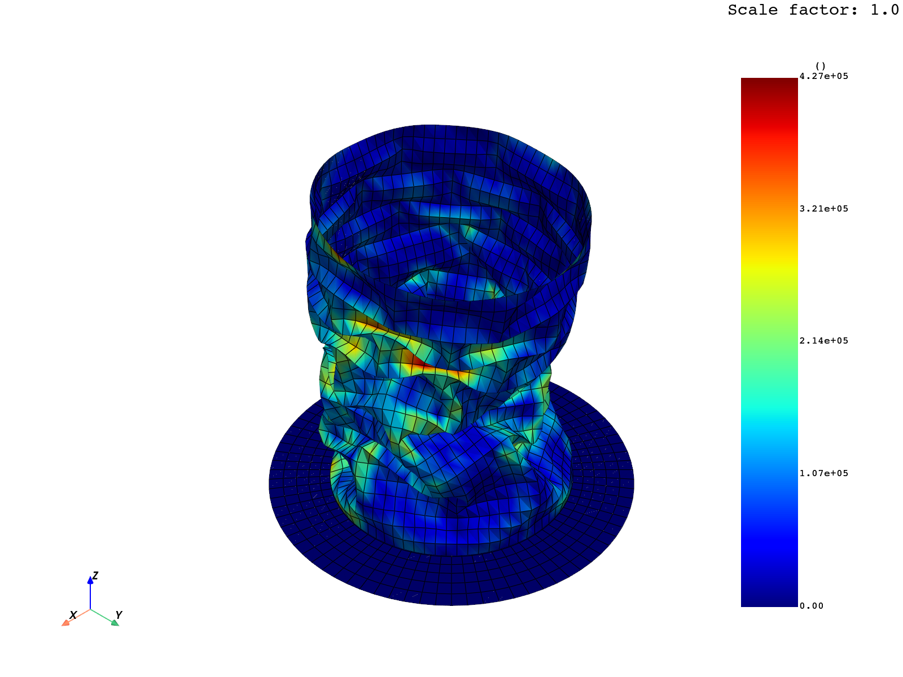
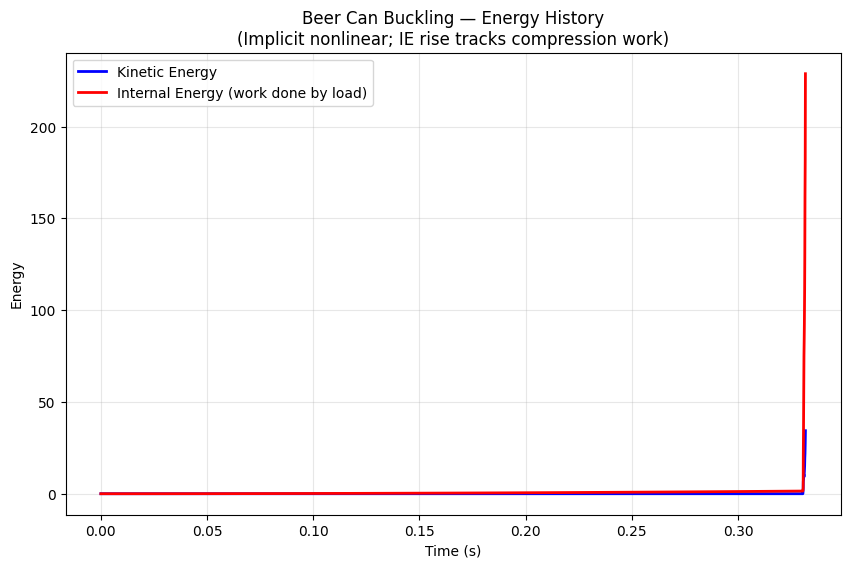

# Beer Can Buckling (PyDyna example)

## What it demonstrates

Highly nonlinear buckling of a thin-walled aluminum can under axial
compression. **The solver intentionally does NOT fully converge to t=1.0**
— that's the physical signature of buckling instability (snap-through
limit point).

## Files

```
pydyna_buckling_beer_can/
├── README.md
├── mesh.k                             ← can mesh (520 KB)
├── scripts/
│   ├── run_beer_can.ps1               ← PowerShell driver — 17 steps via sim CLI
│   ├── render_evidence.py             ← DPF post-processing
│   └── bc_data.json                   ← 76 load nodes + 152 BC nodes (extracted from official source)
└── evidence/
    ├── transcript.json                ← full sim CLI command log
    ├── physics_summary.json
    ├── energy_plot.png                ← energy spike at buckling event
    ├── compression_curve.png          ← Z-displacement of compressed face
    └── buckled_can.png                ← classic Yoshimura diamond pattern!
```

## How to reproduce

```powershell
pwsh -File scripts/run_beer_can.ps1
```

## Verified physics results

| Metric | Value | Interpretation |
|--------|-------|---------------|
| Output states | 49 | dt=1e-4, but reached only t=0.33 |
| Mesh | 3437 nodes, 3320 elements | Full can + floor |
| Termination time reached | **0.33 / 1.00 (33%)** | **Buckling limit point** — solver gives up at the snap-down |
| KE max | 34 | Spike at the instability |
| IE max | 229 | All accumulated compression work released into buckling |
| Max displacement | 1.53 in | Significant axial collapse |
| von Mises stress max | 475 GPa | Numerical artifact at fold creases |

## Visual evidence

### The crushed can — Yoshimura diamond pattern

Exactly what you see when you crush a real soda can: alternating triangular
folds form a diamond pattern around the wall. Stress concentrations (yellow/
red) trace the buckle creases:



### Energy history — the snap-down event

For 32% of the simulated time, almost nothing happens (smoothly increasing
compressive load, elastic shortening). Then at t≈0.32 the buckling instability
triggers and energies jump abruptly:
- IE: 0 → 229 (compression work suddenly released into folding)
- KE: 0 → 34 (the buckled regions snap into their new shape)



This shape of the energy curve — **flat for most of the run, then a sudden
spike** — is the diagnostic signature of buckling. Linear analyses would
show this as an eigenvalue going imaginary; here we see the equivalent in
energy time history.

## Why convergence "failure" is actually success

For elastic linear problems, you check whether the solver converged.
For buckling problems, **the solver hitting its limit is the answer** —
the structure has become globally unstable and there is no longer a valid
quasi-static equilibrium path. To continue past the limit point, you'd need:
- Arc-length continuation (`*CONTROL_IMPLICIT_STABILIZATION`)
- Or switch to explicit dynamics with damping
- Or accept that the post-buckling response is path-dependent and not
  uniquely defined by the input deck

The PyDyna documentation explicitly notes:
> *"It is a highly nonlinear problem whose solution will not fully converge,
> but that is expected."*

## When to reach for this template

- Imperfection-sensitive thin-walled structures (cans, tubes, shells)
- Plastic collapse with snap-through
- Cases where convergence "failure" is the actual phenomenon
- Mortar contact (`ContactAutomaticSingleSurfaceMortar` — the modern standard)
- Implicit dynamics with `ControlImplicitDynamics`

## Source

Official: https://dyna.docs.pyansys.com/version/stable/examples/Buckling_Beer_Can/plot_beercan.html
Origin: https://lsdyna.ansys.com/example-nonlinear-2/
