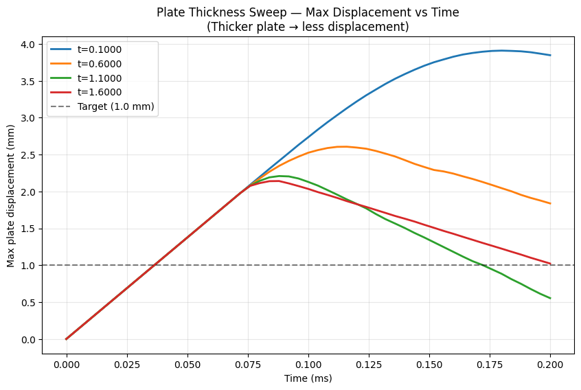
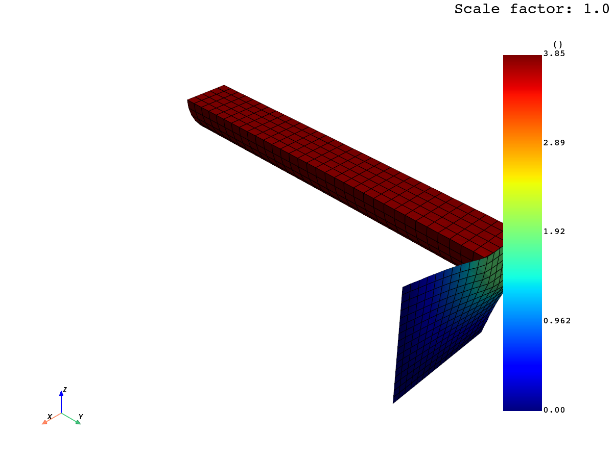
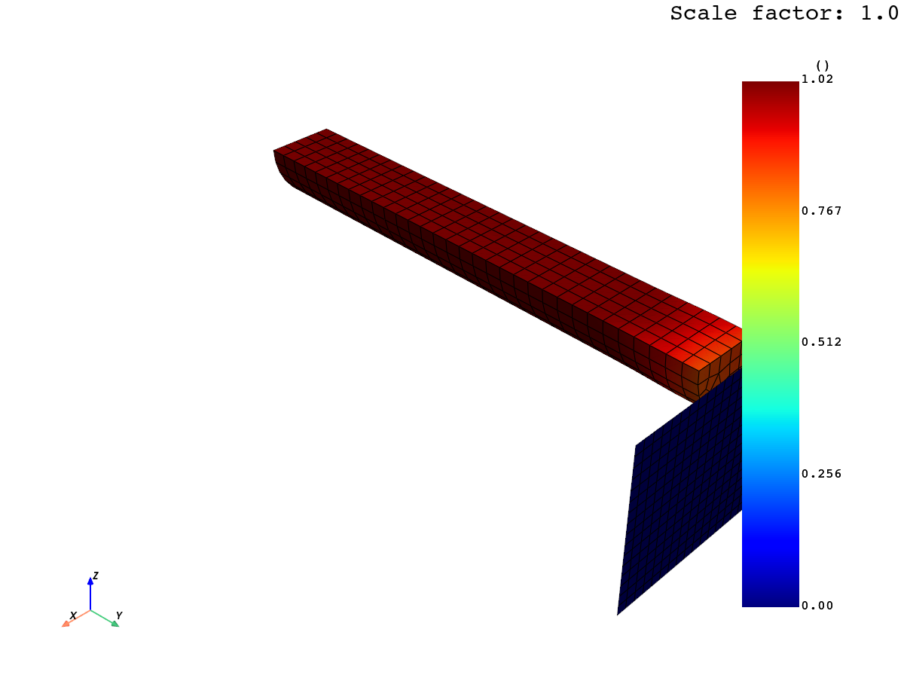

# Plate Thickness Optimization (PyDyna example)

## What it demonstrates

A **parametric sweep** over plate thickness, run iteratively via PyDyna.
Each iteration: build deck for the current thickness → solve → extract max
plate displacement via DPF → loop with new thickness.

This is the canonical *DOE / optimization* pattern with sim CLI.

## Files

```
pydyna_optimization/
├── README.md
├── bar_impact_mesh.k                 ← mesh shared across all iterations (199 KB)
├── scripts/
│   ├── opt_helpers.py                ← deck builder + run_iteration() — loaded into session
│   ├── run_optimization.ps1          ← PowerShell driver — orchestrates the sweep
│   └── render_evidence.py            ← multi-line plot + best/worst case images
└── evidence/
    ├── transcript.json               ← full sim CLI command log
    ├── physics_summary.json
    ├── thickness_sweep.png           ← max disp vs time, 4 thicknesses overlaid
    ├── deformed_most_stiff_t1.6000.png   ← thick plate barely deforms
    └── deformed_least_stiff_t0.1000.png  ← thin plate deflects clearly
```

## How to reproduce

```powershell
# Default: 4 iterations, thicknesses [0.1, 0.6, 1.1, 1.6]
pwsh -File scripts/run_optimization.ps1

# Custom sweep:
pwsh -File scripts/run_optimization.ps1 -MaxIterations 8 -InitialThickness 0.2 -ThicknessIncrement 0.3
```

## Architecture

The PowerShell harness drives the loop, but **all simulation work happens
inside the persistent sim session**:

```
sim connect                                    (1×)
sim exec "exec(opt_helpers.py)"                (1× — loads create_input_deck, run_iteration)
sim exec "MESH_SRC = '...'"                    (1× — pin mesh path)
for thickness in [0.1, 0.6, 1.1, 1.6]:
    sim exec "_result = run_iteration(thickness, case_dir, MESH_SRC)"  (1× per iter)
    sim inspect last.result                                            (1× per iter)
sim exec "results = ..."                       (1× — collate)
sim disconnect                                 (1×)
```

Each `run_iteration()` call internally does:
1. Build deck for this thickness via `create_input_deck(thickness)`
2. Copy mesh into the per-iteration workdir
3. `deck.export_file('input.k')`
4. `run_dyna('input.k', working_directory=case_dir)`
5. Open d3plot with DPF, extract max nodal displacement
6. Return dict {thickness, max_disp, ...}

This shows the **agent-driven optimization loop**: each iteration's result
is visible to the agent via `sim inspect last.result`, so the agent could
in principle decide whether to continue, pick the next thickness adaptively,
etc.

## Verified physics results

| Thickness (mm) | Max plate disp (mm) | Notes |
|----------------|---------------------|-------|
| 0.10 | **3.91** | Thinnest, most flex |
| 0.60 | 2.61 | |
| 1.10 | 2.21 | |
| 1.60 | **2.14** | Thickest, stiffest |

Each iteration: 52 output states (dt=4e-6, endtim=2e-4 ms), bar impact at
275 m/s onto the plate.

The expected monotonic trend is clearly observed — **thicker plate → less
displacement** — and the curve flattens (diminishing returns) above ~1 mm.

## Visual evidence

### Multi-thickness sweep — max displacement vs time

All 4 thicknesses overlaid on one plot. The dashed line at 1.0 mm is the
"target displacement" from the official example; none of our 4 sample
thicknesses reach it (need plate > ~3 mm based on the trend):



### Comparison: thinnest vs thickest plate

**Thinnest (t=0.1 mm)** — plate clearly deforms, bar penetrates further:



**Thickest (t=1.6 mm)** — plate barely deforms, bar bounces off:



## When to reach for this template

- DOE (design of experiments) sweeps
- Optimization loops (gradient-free or Bayesian)
- Sensitivity analyses
- Any case where you need to run LS-DYNA tens or hundreds of times with
  different parameters and post-process each result

## Key technique demonstrated

**Loading helper Python into the session** via:
```python
sim exec "_g = globals(); exec(open('opt_helpers.py', encoding='utf-8').read(), _g)"
```

The `globals()` trick is required because `exec(code)` inside another
exec'd snippet creates a nested scope by default — passing `_g` explicitly
makes definitions land in the session namespace where subsequent
`sim exec` calls can see them.

The `encoding='utf-8'` is required on Chinese Windows where Python's
`open()` defaults to GBK (KI-related: documented in the runtime).

## Source

Official: https://dyna.docs.pyansys.com/version/stable/examples/Optimization/Plate_Thickness_Optimization.html
Raw doc: [`../../pydyna_raw/examples/Optimization/Plate_Thickness_Optimization.md`](../../pydyna_raw/examples/Optimization/Plate_Thickness_Optimization.md)
