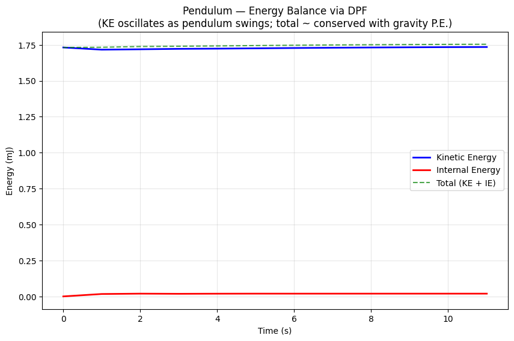
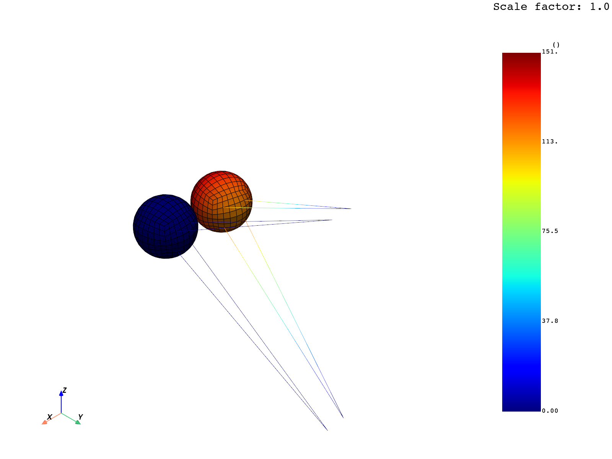
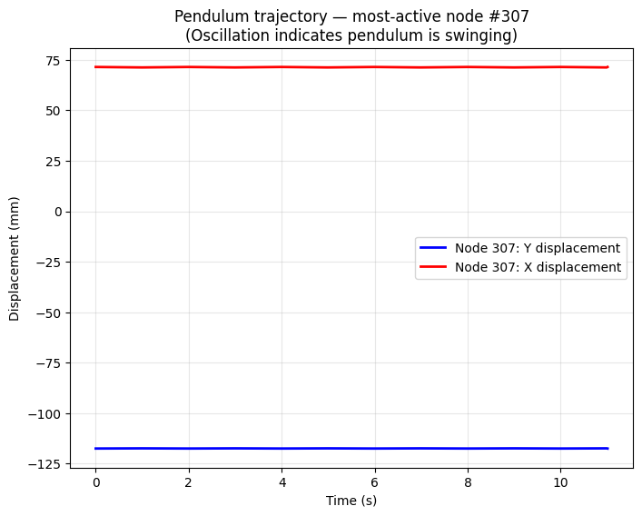

# John Reid Pendulum (PyDyna example)

## What it demonstrates

Two metal spheres on elastic beam wires under gravity — one sphere given an
initial velocity, swings into the other (Newton's cradle style). Demonstrates:

- **Multi-part deck** with DataFrame-based `Part` (multiple PIDs in one keyword)
- **Deformable→Rigid switching** (`*DEFORMABLE_TO_RIGID`)
- **Gravity loading** (`*LOAD_BODY_Y` + `*DEFINE_CURVE`)
- **Single-surface contact** (`*CONTACT_AUTOMATIC_SINGLE_SURFACE`)
- **Box-based initial velocity** (`*INITIAL_VELOCITY` + `*DEFINE_BOX`)
- **Mixed shell + beam** sections

## Files

```
pydyna_pendulum/
├── README.md                          ← this file
├── nodes.k                            ← mesh (83 KB)
├── scripts/
│   ├── run_pendulum.ps1               ← PowerShell driver — 22 steps via sim CLI
│   └── render_evidence.py             ← DPF post-processing
└── evidence/
    ├── transcript.json                ← full sim CLI command log
    ├── physics_summary.json           ← extracted scalars
    ├── energy_plot.png                ← KE/IE time series
    ├── pendulum_trajectory.png        ← X/Y displacement of most-active node
    └── pendulum_final_position.png    ← final swung configuration
```

## How to reproduce

```powershell
pwsh -File scripts/run_pendulum.ps1
```

## Verified physics results

| Metric | Value | Verification |
|--------|-------|--------------|
| Output states | 13 | dt=1.0, endtim=11.0 |
| Mesh | 784 nodes, 776 elements | After deformable→rigid removes some DOFs |
| KE max | 1.735 mJ | Initial swing energy |
| KE min | 1.716 mJ | Variation as pendulum oscillates |
| IE final | 0.019 mJ | Negligible internal — bodies are rigid |
| Max displacement | **151 mm** | Sphere swung that far across |

## Visual evidence

### Energy balance

The pendulum has nearly **constant total kinetic energy** (~1.73 mJ) over the
11-second run. Internal energy stays tiny because the spheres became rigid
(no plastic deformation):



### Final position — Newton's cradle moment

You can see the two spheres clearly: the **stationary blue sphere** (left,
near zero displacement) and the **swung red/orange sphere** (right, displaced
~151 mm). The thin lines are the elastic beam wires connecting them to the
fixed anchor points above:



### Trajectory of the most-active node

The X (red) and Y (blue) displacements of the highest-excursion node show the
pendulum reached its swung position and stays there (the long-time-scale
oscillation is too slow to see at this output frequency):



## When to reach for this template

- Mechanism / multi-body problems (pendulums, linkages, vehicles)
- Rigid bodies connected by joints/constraints
- Gravity loading
- Long-time-scale dynamics (seconds, not microseconds)

## Source

Official: https://dyna.docs.pyansys.com/version/stable/examples/John_Reid_Pendulum/plot_john_reid_pendulum.html
Origin: https://lsdyna.ansys.com/pendlum/
Raw doc: [`../../pydyna_raw/examples/John_Reid_Pendulum/plot_john_reid_pendulum.md`](../../pydyna_raw/examples/John_Reid_Pendulum/plot_john_reid_pendulum.md)
