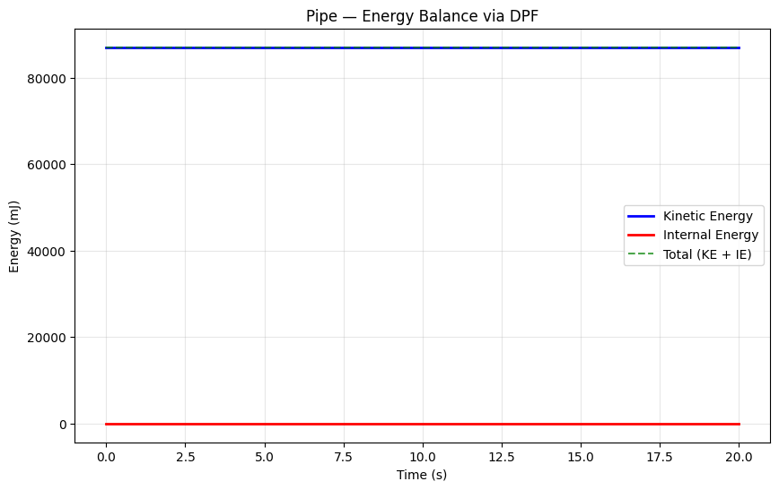
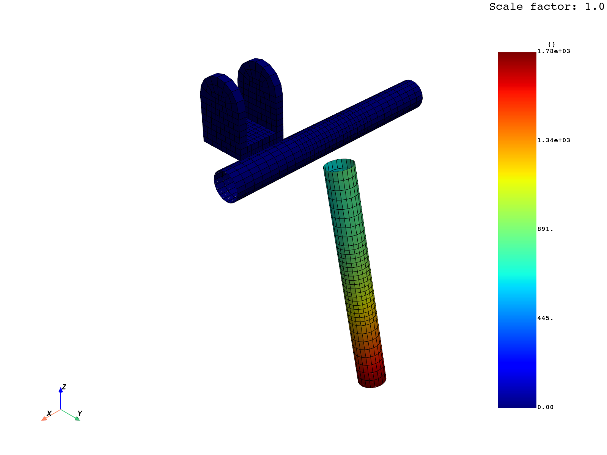

# John Reid Pipe (PyDyna example)

## What it demonstrates

A rotating steel pipe slipping through a rigid bracket constraint.
Demonstrates **rigid-body dynamics with contact + initial angular velocity**:

- **Multi-section parts** (3 pipe parts + 1 bracket part)
- **`InitialVelocityGeneration` with `omega`** — angular velocity around an axis
- **`SetPartList`** for grouping parts into contact / IC scopes
- **`ContactForceTransducerPenalty`** — instrument contact for force history
- **`DeformableToRigid`** switching to make pipe parts rigid
- **`MatRigid` with `cmo=1, con1=7, con2=7`** — fully constrained bracket

## Files

```
pydyna_pipe/
├── README.md
├── nodes.k                            ← mesh (210 KB)
├── scripts/
│   ├── run_pipe.ps1                   ← PowerShell driver — 21 steps via sim CLI
│   └── render_evidence.py             ← DPF post-processing
└── evidence/
    ├── transcript.json                ← full sim CLI command log
    ├── physics_summary.json
    ├── energy_plot.png                ← KE constant (rigid-body conservation)
    └── pipe_final_position.png        ← rotated/displaced pipe + bracket
```

## How to reproduce

```powershell
pwsh -File scripts/run_pipe.ps1
```

## Verified physics results

| Metric | Value | Verification |
|--------|-------|--------------|
| Output states | 22 | dt=1.0, endtim=20.0 |
| Mesh | 2049 nodes, 1704 elements | After deformable→rigid |
| KE max / final | 87,042 mJ / 87,042 mJ | Constant — rigid-body angular KE conserved |
| IE final | ~0 | All bodies rigid → no plastic dissipation |
| Max displacement | **1781 mm** | Pipe rotated and slipped through bracket |

## Visual evidence

### Energy balance — perfect conservation

KE stays at exactly 87,042 mJ over the entire 20 s. This is the diagnostic
signature of a **rigid-body-only system**: no plastic deformation means no
energy can leak from KE to IE.



### Final configuration — rotated & slipped pipe

The original pipe (blue, horizontal) and the U-shaped bracket (blue, top
left). The deformed/rotated pipe is shown as a separate body (rainbow
contour) — it has rotated by ~1.6 rad (-0.082 rad/s × 20 s) and
slipped completely through the bracket due to gravity-free angular momentum:



## When to reach for this template

- Constrained rotational dynamics (shafts, gears, axles)
- Rigid bodies sliding on/through other rigid bodies
- Contact-instrumented systems (force transducers)
- Long-time-scale rigid-body kinematics

## Source

Official: https://dyna.docs.pyansys.com/version/stable/examples/John_Reid_Pipe/plot_john_pipe.html
Origin: https://lsdyna.ansys.com/pipe-d51/
Raw doc: [`../../pydyna_raw/examples/John_Reid_Pipe/plot_john_pipe.md`](../../pydyna_raw/examples/John_Reid_Pipe/plot_john_pipe.md)
