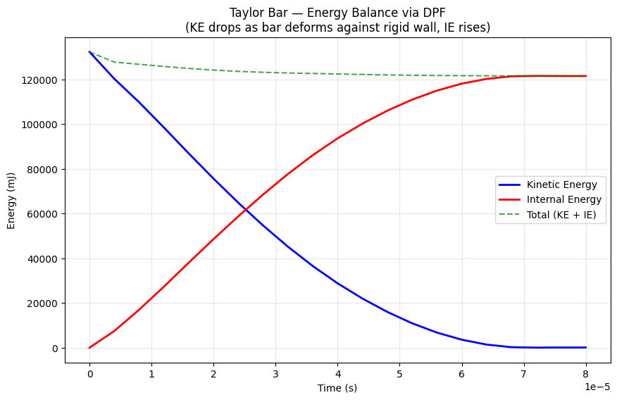
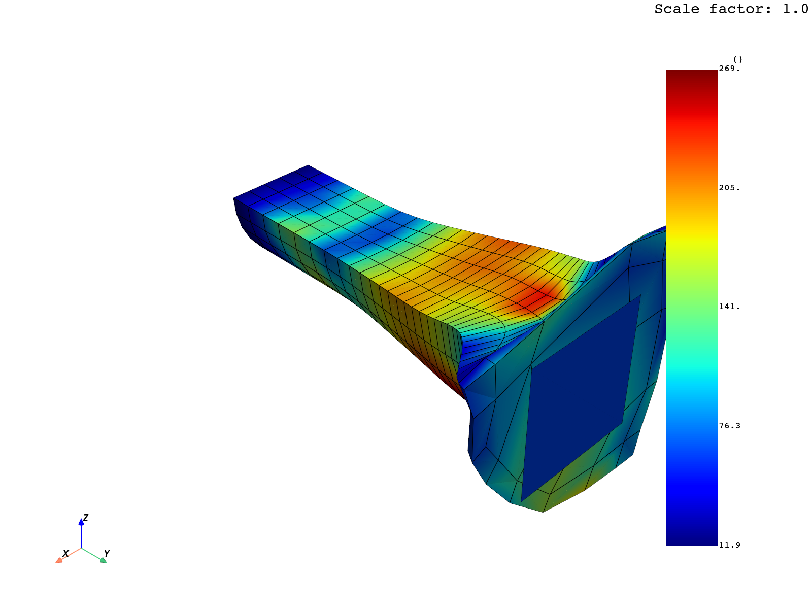

# Taylor Bar Impact (PyDyna example)

## What it demonstrates

The Taylor bar is a classic explicit dynamics verification: a metal cylinder
fired at high velocity into a rigid wall, deforming plastically on impact
(producing the characteristic mushroom-head shape).

This workflow shows the **complete end-to-end run via real `sim` CLI commands**:
1. `sim connect --solver ls_dyna` — open session
2. ~13× `sim exec "deck.append(kwd.XXX(...))"` — build the deck incrementally
3. `sim inspect deck.summary` — verify the deck before solve
4. `sim exec "deck.export_file(...)"` + `sim exec "run_dyna(...)"` — write & solve
5. `sim inspect results.summary` — DPF auto-loads d3plot
6. `sim exec` to extract KE / IE / displacement via DPF
7. `sim disconnect`

## Files in this workflow

```
pydyna_taylor_bar/
├── README.md                     ← this file
├── taylor_bar_mesh.k             ← the mesh (157 KB, included for reproducibility)
├── scripts/
│   ├── run_taylor_bar.ps1        ← PowerShell driver — runs the full E2E via sim CLI
│   └── render_evidence.py        ← post-processing: DPF → matplotlib + PyVista PNGs
└── evidence/
    ├── transcript.json           ← full sim CLI command + response log (25 steps)
    ├── physics_summary.json      ← extracted scalars (KE, IE, max disp, max stress)
    ├── energy_plot.png           ← KE / IE / Total time series
    └── stress_contour.png        ← final von Mises stress on deformed mesh
```

## How to reproduce

Prerequisites:
- `sim serve` running on `127.0.0.1:7700`
- `ansys-dyna-core`, `ansys-dpf-core`, `matplotlib`, `pyvista` installed
- LS-DYNA + ANSYS install discoverable

```powershell
# From this directory:
pwsh -File scripts/run_taylor_bar.ps1

# Or override host/port:
pwsh -File scripts/run_taylor_bar.ps1 -SimHost 192.168.1.10 -SimPort 7600
```

## Verified physics results

| Metric | Value | Verification |
|--------|-------|--------------|
| Cycles | (variable) | LS-DYNA picks dt automatically |
| Output states | 22 | dt=4e-6, endtim=8e-5 |
| Mesh | 1126 nodes, 769 elements | From taylor_bar_mesh.k |
| Initial KE | 132,318 mJ | Matches ½·m·v² for 300 m/s impact |
| Final KE | 84 mJ | Bar essentially stopped at wall |
| Final IE | 121,514 mJ | Plastic work absorbed by deformation |
| Energy balance (KE+IE) | 121,599 mJ | ~92% of initial (rest = hourglass / contact) |
| Max displacement | 13.82 mm | Mushroom head expansion |
| Max von Mises stress | 269 MPa | Above yield (390 MPa) → plastic regime |
| Mean von Mises stress | 121 MPa | Bulk of material |

## Visual evidence

### Energy balance over time

`evidence/energy_plot.png` shows KE (blue) decaying to ~0 while IE (red) rises
to absorb the impact energy. The dashed Total line confirms approximate
energy conservation:



### Final stress contour with deformation

`evidence/stress_contour.png` shows the deformed bar at the last state with
von Mises stress as the fringe. The classic mushroom-head pattern at the
impact end is clearly visible:



## Why it's the most relevant example for this skill

Taylor bar shares the same physics class as our `single_hex_tension` E2E:
- Single part, solid elements, MAT_PLASTIC_KINEMATIC
- Explicit dynamics with short termination time
- Initial velocity → impact → energy dissipation
- d3plot + glstat + matsum output

**Difference**: Taylor bar adds *contact* (rigid wall via `RigidwallPlanar` +
`SetNodeGeneral` + `DefineBox`) and uses *PyDyna's `DownloadManager`* to fetch
the mesh. Use this example as the template for any single-part impact / drop /
crash test.

## Source

Official: https://dyna.docs.pyansys.com/version/stable/examples/Taylor_Bar/plot_taylor_bar.html

## Key code excerpts

### Material (MAT_PLASTIC_KINEMATIC)
```python
mat_1 = kwd.Mat003(mid=1)
mat_1.ro = 7.85e-9    # density (tonne/mm³)
mat_1.e = 150000.0    # Young's modulus (MPa)
mat_1.pr = 0.34       # Poisson's ratio
mat_1.sigy = 390.0    # yield stress (MPa)
mat_1.etan = 90.0     # tangent modulus
```

### Initial velocity on a part
```python
init_vel = kwd.InitialVelocityGeneration()
init_vel.id = 1
init_vel.styp = 2          # 2 = part
init_vel.vy = 300e3        # mm/s = 300 m/s
init_vel.icid = 1
```

### Rigid wall via node set + box
```python
box = kwd.DefineBox(boxid=1, xmn=-500, xmx=500, ymn=39.0, ymx=40.1, zmn=-500, zmx=500)
ns = kwd.SetNodeGeneral(sid=1, option="BOX", e1=box.boxid)
rw = kwd.RigidwallPlanar(id=1)
rw.nsid = ns.sid
rw.yt = box.ymx
rw.yh = box.ymn
```

### DPF post-processing — extract global kinetic energy
```python
gke_op = dpf.operators.result.global_kinetic_energy()
gke_op.inputs.data_sources.connect(_data_sources)  # auto-set by runtime
ke = gke_op.eval().get_field(0).data
```
