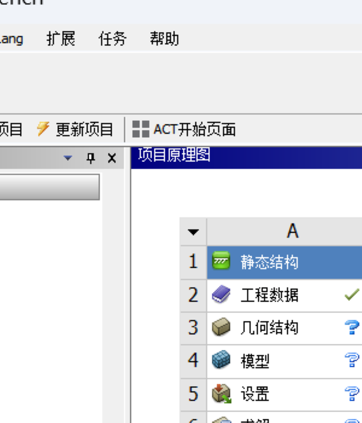
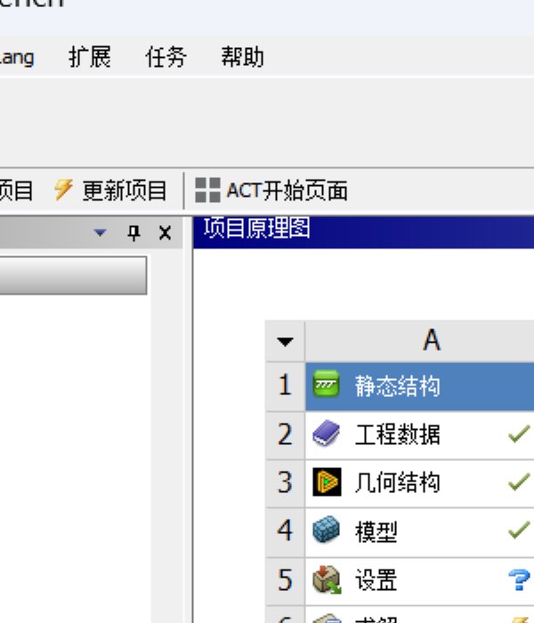

# Visual Evidence: Workbench Cell State Transitions

These screenshots are the visual proof that PyWorkbench can drive a
Static Structural project's cell states from "unconfigured" (blue `?`)
to "successful" (green `checkmark`).

**Test environment**: Ansys 2024 R1 (v241) + PyWorkbench SDK 0.4.0

## The 3-state transition

### State 1: Freshly created system


After `GetTemplate("Static Structural").CreateSystem()`:

- **Engineering Data**: green checkmark — default Structural Steel material is loaded
- **Geometry**: blue `?` — no file attached
- **Model**: blue `?` — no geometry to mesh
- **Setup**: blue `?` — no model to configure

### State 2: After geometry refresh


After `geo.SetFile(FilePath=abs_path)` + `geo.Refresh()`:

- **Engineering Data**: green checkmark (unchanged)
- **Geometry**: **green checkmark** — SpaceClaim parsed the `.agdb` file successfully. Icon changed from generic geometry to green "play" icon, indicating the cell has been processed.
- **Model**: **green refresh arrow** — upstream changed, Model cell is "stale" and needs re-update
- **Setup**: blue `?` (unchanged)

### State 3: After system update


After `system1.Update()`:

- **Engineering Data**: green checkmark
- **Geometry**: green checkmark
- **Model**: **green checkmark** — Mechanical opened the geometry, created bodies, generated default mesh
- **Setup**: blue `?` — Mechanical needs boundary conditions (PyMechanical skill's job)
- **Solution**: blue `?`
- **Results**: blue `?`

## What this proves

1. **Workbench orchestration works end-to-end** for the cells it OWNS:
   Engineering Data (material definition), Geometry (CAD import),
   Model (mesh generation via Mechanical autostart).

2. **The division of labor is correct**: Workbench handles "project-level"
   orchestration (uploading files, importing geometry, triggering cell
   updates). Mechanical (via PyMechanical) handles "physics-level"
   operations (BC scoping, load application, solver execution, result
   extraction).

3. **The cell state icons are a reliable validation signal**:
   - green checkmark = cell successfully updated
   - blue `?` = cell needs input/configuration
   - green refresh arrow = cell needs re-update due to upstream change

## How to reproduce

```bash
cd E:/simcli/sim-cli
uv run python tests/execution/update_geometry_for_checkmark.py
```

Prerequisites:
- Ansys 2024 R1 installed
- PyWorkbench SDK 0.4-0.9 (`uv pip install "ansys-workbench-core>=0.4,<0.10"`)
- `two_pipes.agdb` at `%TEMP%/two_pipes.agdb` (auto-downloaded from
  `github.com/ansys/example-data/raw/master/pyworkbench/pymechanical-integration/agdb/two_pipes.agdb`)

Screenshots land in `C:/Temp/cell_*.png` (full) and `cell_*_crop.png` (zoomed).

## What CANNOT be done from Workbench

The remaining 3 cells (Setup / Solution / Results) are **intentionally**
not updated by Workbench. They require:

- **Setup**: Boundary conditions (face-level scoping), loads, contacts —
  defined via PyMechanical or interactive Mechanical GUI.
- **Solution**: Solver launch, iteration control, convergence monitoring —
  done by Mechanical's MAPDL solver, orchestrated by PyMechanical.
- **Results**: Post-processing, result extraction, plot generation —
  done via PyMechanical's result tree navigation.

These are the subject of a separate **PyMechanical skill**, not this
Workbench skill.
